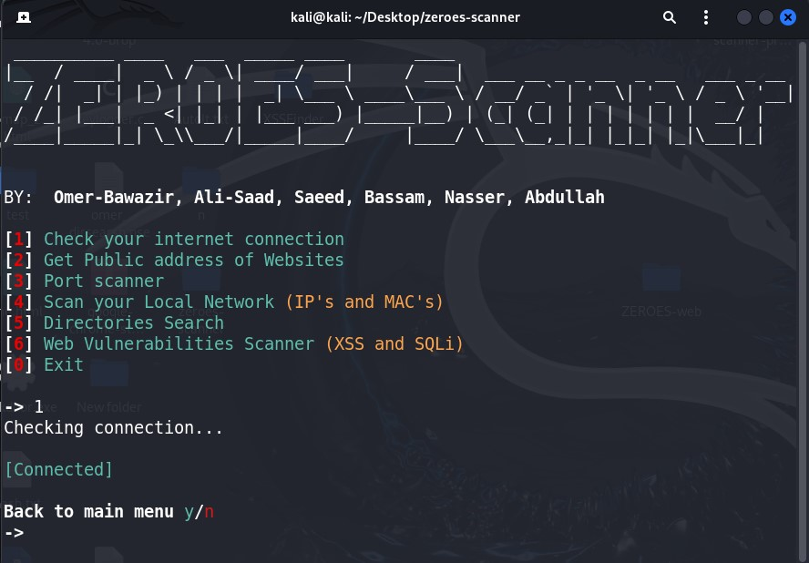
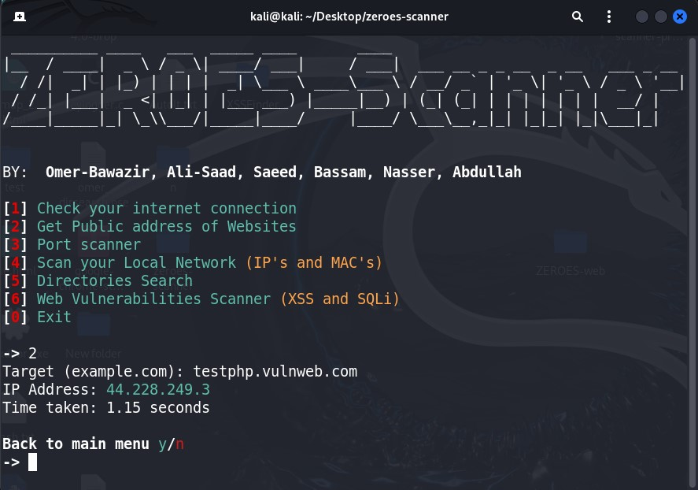
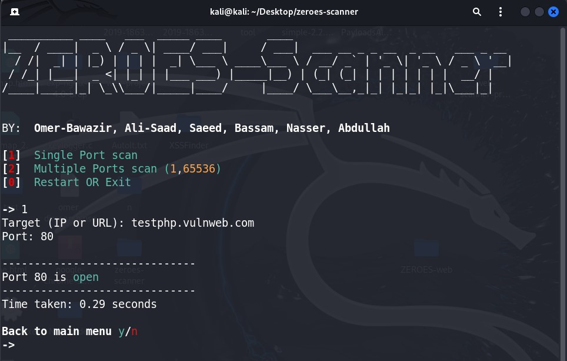
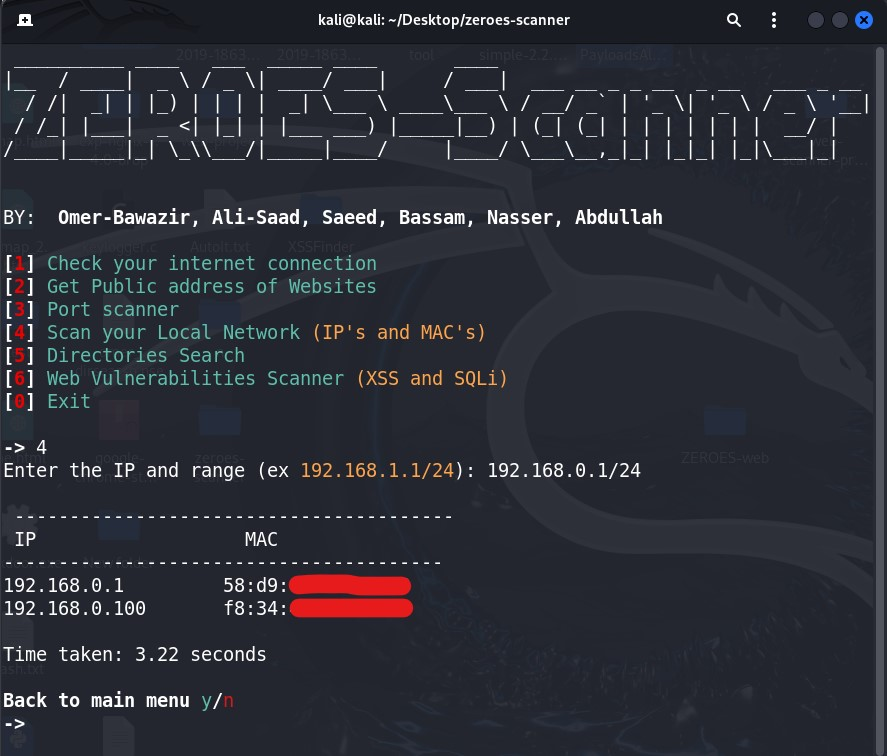
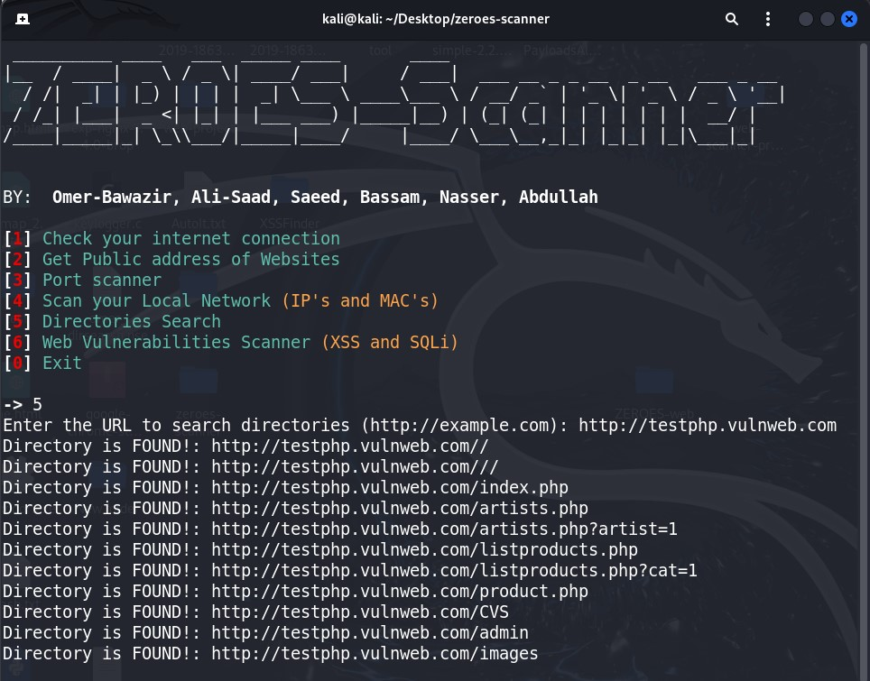
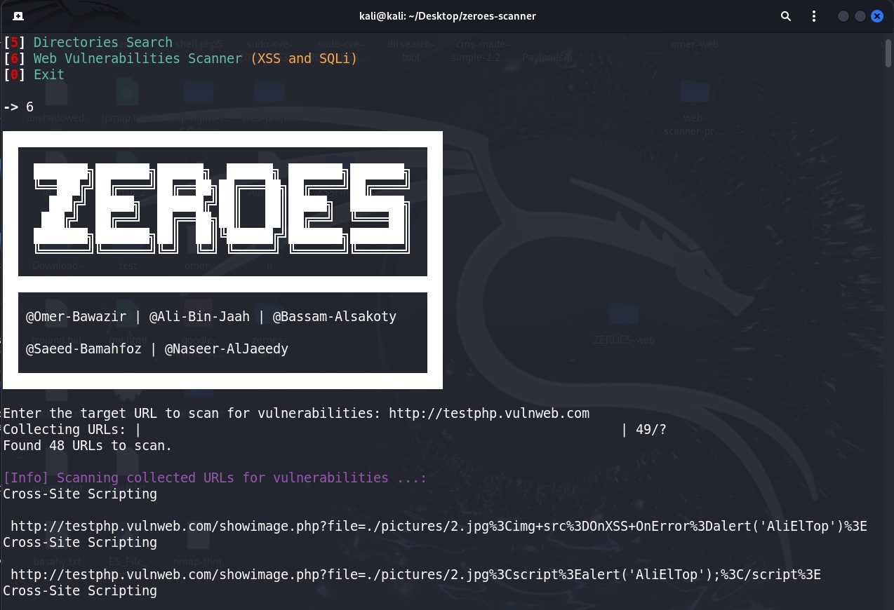
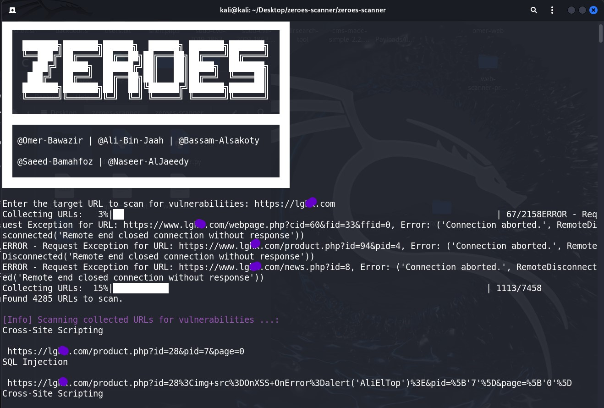

# zeroes-scanner
zeroes-scanner is an all-in-one Python tool for network and website security scanning. It includes checking internet connection, retrieving public IP, port scanning, local network scanning, directory search, and detecting XSS and SQLi vulnerabilities.


## Download and Setup on Linux

To download this repo, in a Terminal, run:

```bashj
git clone https://github.com/Omer-Secure/zeroes-scanner
```
```bashj
cd zeroes-scanner
```
```bashj
sudo chmod +x *
```
```bashj
pip install requirements.txt

OR

sudo pip install requirements.txt
```

You'll now have the `zeroes-scanner` folder in your home folder.


## Usage

```bashj
sudo python3 zeroes.py
```

<div align="center" width="50">  </div>
<div align="center" width="50">  </div>
<div align="center" width="50">  </div>
<div align="center" width="50">  </div>
<div align="center" width="50">  </div>
<div align="center" width="50">  </div>
<div align="center" width="50">  </div>


Please Support ME with a Star ...
